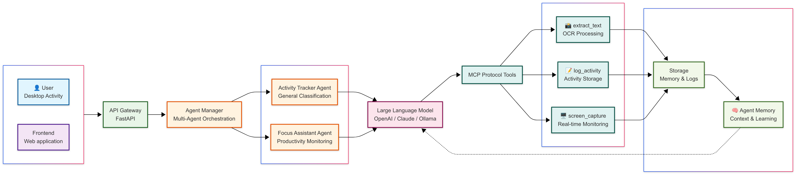

# Vygil - Autonomous Activity Tracking & Anomaly Detection

> **AI-powered activity monitoring with secure screen capture and intelligent multi-agent architecture**


## 🎯 Overview

Vygil is an autonomous AI agent platform that provides intelligent activity tracking using computer vision and large language models. Unlike traditional activity trackers, Vygil employs **true agentic AI** that makes independent decisions about tool usage, maintains persistent memory, and adapts to user patterns in real-time.

### ✨ Key Features

- 🤖 **Multi-Agent Architecture** - Switch between Activity Tracker and Focus Assistant agents
- 🧠 **Memory Persistence** - Agents maintain context across sessions with intelligent memory injection
- 🔧 **MCP Protocol Integration** - Extensible tool ecosystem using Model Context Protocol
- 🎯 **Focus Analytics** - Advanced productivity tracking with distraction detection
- 🌐 **Real-time Dashboard** - Beautiful web interface with live monitoring
- 🔄 **Multi-LLM Support** - OpenAI, Anthropic, Ollama with automatic fallbacks
- 🛡️ **Privacy-First** - Local processing with user consent and secure data handling

## 🏗️ Architecture

Vygil follows a sophisticated multi-layer architecture designed for scalability and extensibility:

```
┌─────────────────┐    ┌─────────────────┐    ┌─────────────────┐
│   Frontend      │    │   API Gateway   │    │   Agent Core    │
│   React + Vite  │◄──►│   FastAPI       │◄──►│   Python        │
│                 │    │                 │    │                 │
│ • Agent Picker  │    │ • REST Endpoints│    │ • Agent Manager │
│ • Live Monitor  │    │ • Multi-Agent   │    │ • LLM Processor │
│ • Focus UI      │    │ • Real-time API │    │ • Memory System │
└─────────────────┘    └─────────────────┘    └─────────────────┘
        │                       │                       │
        │                       ▼                       ▼
        │              ┌─────────────────┐    ┌─────────────────┐
        │              │   MCP Server    │    │   LLM Providers │
        └──────────────│   Node.js + TS  │    │   Multi-Cloud   │
                       │                 │    │                 │
                       │ • Screen Tools  │    │ • OpenAI        │
                       │ • OCR Engine    │    │ • Anthropic     │
                       │ • Activity Logs │    │ • Ollama        │
                       └─────────────────┘    └─────────────────┘
```

### 🔄 Agentic Workflow

1. **User Activity** → Screen capture via MCP tools
2. **Agent Decision** → LLM autonomously selects appropriate tools
3. **Context Processing** → OCR + memory injection + previous activities
4. **AI Analysis** → Multi-provider LLM classification with reasoning
5. **Autonomous Execution** → Agent runs custom code for memory updates
6. **Real-time Updates** → Live dashboard with focus metrics and insights

## 🚀 Agents

### 🎯 Activity Tracker Agent
*Monitors and logs your screen activity with AI-powered classification*

**Capabilities:**
- Memory Persistence
- Context Injection  
- Autonomous Execution
- MCP Tools
- Multi-LLM Support
- Confidence Scoring

**Use Case:** General activity monitoring and logging

### 🧠 Focus Assistant Agent
*Helps maintain focus by detecting distractions and tracking productivity*

**Capabilities:**
- Memory Persistence
- Context Injection
- Autonomous Execution
- MCP Tools
- Multi-LLM Support
- Focus Tracking
- Productivity Analysis
- Distraction Alerts
- Confidence Scoring
- Adaptive Learning

**Use Case:** Productivity optimization and distraction management



## 📋 Prerequisites

- **Node.js** >= 18.0.0
- **Python** >= 3.8
- **Git**
- **API Keys** (at least one):
  - OpenAI API Key
  - Anthropic API Key
  - Fireworks AI API Key

## 🛠️ Installation & Setup

### 1. Clone the Repository

```bash
git clone https://github.com/your-username/vygil-ai.git
cd vygil-ai
```

### 2. Environment Configuration

Create a `.env` file in the root directory:

```bash
# LLM API Keys (at least one required)
OPENAI_API_KEY=your_openai_api_key_here
ANTHROPIC_API_KEY=your_anthropic_api_key_here

# Optional: Database Configuration
DATABASE_PATH=./data/vygil.db

# Optional: Agent Settings
DEFAULT_AGENT=vygil-focus-assistant
LOG_LEVEL=INFO
```

### 3. Install Dependencies

```bash
# Install Python dependencies
pip install -r requirements.txt

# Install Node.js dependencies for MCP server
cd mcp-server
npm install
npm run build
cd ..

# Install frontend dependencies
cd frontend
npm install
cd ..
```

### 4. Build MCP Server

```bash
cd mcp-server
npm run build
cd ..
```

## 🚀 Running the Application

### Development Mode

You'll need **3 terminal windows**:

#### Terminal 1: Start the API Server
```bash
cd api
python main.py
```
*Server will run on `http://localhost:8000`*

#### Terminal 2: Start the Frontend
```bash
cd frontend
npm run dev
```
*Frontend will run on `http://localhost:5173`*

#### Terminal 3: Test MCP Server (Optional)
```bash
cd mcp-server
npx @modelcontextprotocol/inspector node dist/vygil-mcp-server.js
```

### Access the Application

1. Open your browser and navigate to `http://localhost:5173`
2. Grant screen recording permissions when prompted
3. Select your preferred agent (Activity Tracker or Focus Assistant)
4. Click "Start Monitoring" to begin activity tracking

## 🎛️ Usage

### Getting Started

1. **Select Agent**: Choose between Activity Tracker or Focus Assistant
2. **Grant Permissions**: Allow screen recording for activity monitoring
3. **Start Monitoring**: Begin real-time activity analysis
4. **View Insights**: Monitor live logs and focus metrics
5. **Switch Agents**: Change agents without losing session data

### Agent Configuration

Agents are configured via YAML files in `agent/config/`:

- `activity-tracking-agent.yaml` - General activity monitoring
- `focus-assistant-agent.yaml` - Focus and productivity tracking

### Adding Custom Agents

1. Create a new YAML config file in `agent/config/`
2. Define agent properties, prompts, and capabilities
3. Restart the API server
4. The new agent will appear automatically in the UI

## 📊 Features Deep Dive

### 🧠 Memory System
- **Persistent Context**: Agents remember previous activities across sessions
- **Smart Injection**: Memory content is intelligently injected into LLM prompts
- **Automatic Updates**: Agents autonomously update their memory after each analysis

### 🔧 MCP Integration
- **Standardized Tools**: Screen capture, OCR, and logging via MCP protocol
- **Extensible**: Easy to add new tools without modifying core agent code
- **Industry Standard**: Based on Model Context Protocol specification

### 🎯 Focus Analytics
- **Productivity Scoring**: Real-time focus level assessment (0.0-1.0)
- **Distraction Detection**: Automatic identification of non-productive activities
- **Smart Notifications**: Context-aware alerts with cooldown periods
- **Session Tracking**: Comprehensive focus session analytics


## 📁 Project Structure

```
vygil-ai/
├── agent/                      # Agent core logic
│   ├── config/                 # Agent YAML configurations
│   ├── memory/                 # Persistent agent memory
│   ├── agent.py               # Main agent implementation
│   └── agent_manager.py       # Multi-agent orchestration
├── api/                       # FastAPI backend
│   ├── main.py               # API server and routes
│   └── screenshots/          # Captured screen images
├── frontend/                  # React frontend
│   ├── src/components/       # UI components
│   ├── src/App.jsx          # Main application
│   └── dist/                # Built frontend assets
├── mcp-server/               # MCP protocol server
│   ├── src/                 # TypeScript source
│   ├── dist/                # Compiled JavaScript
│   └── package.json         # Node.js dependencies
├── .env                      # Environment configuration
├── requirements.txt          # Python dependencies
└── README.md                # This file
```


---

**Built with ❤️ by the Vygil AI Team**

*Transforming productivity through intelligent automation*